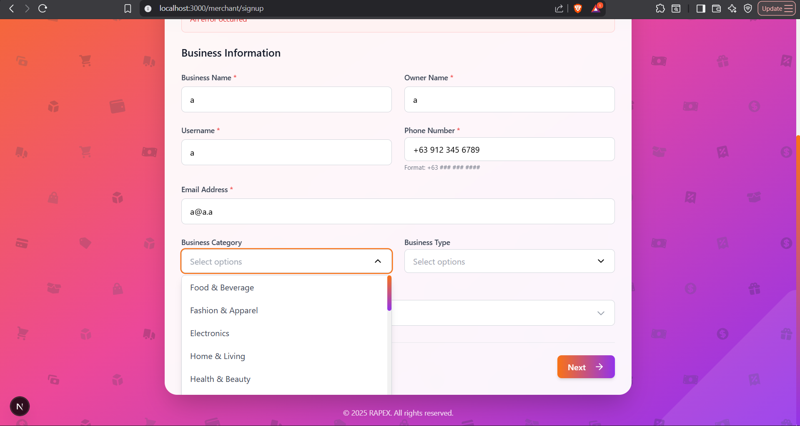

# Merchant Registration System

Complete 3-step merchant account creation system for RAPEX E-Commerce & Delivery Platform.

## Features

### Backend (Django)

#### Architecture
- **Modular Design**: Clean separation of concerns following OOP principles
- **Services Layer**: Business logic isolated in service classes
- **Models**: Comprehensive merchant model with all required fields
- **Serializers**: Step-by-step validation for each registration phase
- **API Endpoints**: RESTful endpoints for each step

#### Components

1. **Models** (`apps/merchants/models.py`)
   - `Merchant` model with authentication (extends `AbstractBaseUser`)
   - Multi-step registration data storage
   - Document upload fields
   - Business information fields
   - Location fields with coordinates
   - Status tracking (PENDING, APPROVED, REJECTED, SUSPENDED)

2. **Services** (`apps/merchants/services/`)
   - `MerchantRegistrationService`: Handles registration logic
     - Password generation
     - Step validation
     - Temporary data storage
     - Registration completion
   - `EmailService`: Handles email notifications
     - Welcome email with credentials
     - Verification status notifications

3. **Serializers** (`apps/merchants/serializers/`)
   - `Step1Serializer`: General info validation
   - `Step2Serializer`: Location validation
   - `Step3Serializer`: Document validation
   - `MerchantSerializer`: Complete merchant data
   - `RegistrationProgressSerializer`: Progress tracking

4. **Views** (`apps/merchants/views.py`)
   - `RegistrationStep1View`: POST /api/merchants/register/step1/
   - `RegistrationStep2View`: POST /api/merchants/register/step2/
   - `RegistrationStep3View`: POST /api/merchants/register/step3/
   - `RegistrationProgressView`: GET /api/merchants/register/progress/<id>/
   - `CheckUniquenessView`: POST /api/merchants/register/check-uniqueness/

5. **Admin** (`apps/merchants/admin.py`)
   - Complete merchant management interface
   - Document viewing
   - Verification workflow

### Frontend (Next.js + TypeScript)

#### Components

1. **MerchantRegistrationForm** (`components/auth/MerchantRegistrationForm.tsx`)
   - Main registration component
   - 3-step wizard with progress tracker
   - Form validation
   - API integration

2. **UI Components**
   - `Stepper`: Progress tracker for multi-step forms
   - `PhoneInput`: Auto-formatting phone number input (+63 XXX XXX XXXX)
   - `MultiSelect`: Category and type selection
   - `FileUpload`: Document upload with preview
   - `MapPicker`: Location selection (current location or manual)

3. **Constants** (`lib/constants.ts`)
   - Business categories
   - Business types
   - Registration types
   - Required documents mapping

## Registration Flow

### Step 1: General Information
**Required Fields:**
- Business Name *
- Owner Name *
- Username * (unique)
- Phone Number * (format: +63 XXX XXX XXXX)
- Email Address * (unique)
- Business Category (multi-select)
- Business Type (multi-select)
- Business Registration Type *
  - Unregistered
  - Registered (NON-VAT)
  - Registered (VAT Included)

### Step 2: Location
**Required Fields:**
- Zip Code *
- Province *
- City/Municipality *
- Barangay *
- Street Name *
- House Number *
- Location Coordinates (optional)
  - Get current location
  - Pick from map (OpenStreetMap)
  - Manual entry

### Step 3: Documents

**For Unregistered:**
- Selfie holding ID * (camera only)
- Valid ID * (camera only)

**For Registered (NON-VAT):**
- Selfie holding ID * (camera only)
- Valid ID * (camera only)
- Barangay Permit *
- DTI Certificate or SEC Certificate *
- BIR Certificate of Registration (Form 2303) (optional)
- Mayor's / Business Permit (optional)
- Other Documents (optional)

**For Registered (VAT Included):**
- Selfie holding ID * (camera only)
- Valid ID * (camera only)
- Barangay Permit *
- DTI Certificate or SEC Certificate *
- BIR Certificate of Registration (Form 2303) *
- Mayor's / Business Permit *
- Other Documents (optional)

### After Registration

1. **Auto-generated password** sent to merchant's email
2. Merchant account created with status: **PENDING**
3. Account marked as `is_new=True` to prompt password change
4. Admin can verify and approve/reject account

## API Endpoints

### Registration

#### Step 1: General Info
```http
POST /api/merchants/register/step1/
Content-Type: application/json

{
  "business_name": "My Store",
  "owner_name": "John Doe",
  "username": "mystore",
  "phone_number": "+63 912 123 1234",
  "email": "store@example.com",
  "business_categories": ["Food & Beverage"],
  "business_types": ["Restaurant"],
  "business_registration": "UNREGISTERED"
}

Response:
{
  "success": true,
  "message": "Step 1 completed successfully",
  "data": {
    "merchant_id": 1,
    "current_step": 1,
    "business_registration": "UNREGISTERED"
  }
}
```

#### Step 2: Location
```http
POST /api/merchants/register/step2/
Content-Type: application/json

{
  "merchant_id": 1,
  "zip_code": "1000",
  "province": "Metro Manila",
  "city": "Manila",
  "barangay": "Ermita",
  "street_name": "Pedro Gil St",
  "house_number": "123",
  "latitude": 14.5995,
  "longitude": 120.9842
}

Response:
{
  "success": true,
  "message": "Step 2 completed successfully",
  "data": {
    "merchant_id": 1,
    "current_step": 2,
    "full_address": "123 Pedro Gil St, Ermita, Manila, Metro Manila 1000"
  }
}
```

#### Step 3: Documents
```http
POST /api/merchants/register/step3/
Content-Type: multipart/form-data

merchant_id: 1
selfie_with_id: [file]
valid_id: [file]
barangay_permit: [file] (if applicable)
dti_sec_certificate: [file] (if applicable)
...

Response:
{
  "success": true,
  "message": "Registration completed successfully! Check your email for login credentials.",
  "data": {
    "merchant_id": 1,
    "email_sent": true,
    "business_name": "My Store",
    "status": "PENDING"
  }
}
```

#### Check Uniqueness
```http
POST /api/merchants/register/check-uniqueness/
Content-Type: application/json

{
  "field": "username",
  "value": "mystore"
}

Response:
{
  "success": true,
  "exists": false,
  "message": "Username is available"
}
```

#### Get Progress
```http
GET /api/merchants/register/progress/1/

Response:
{
  "success": true,
  "data": {
    "merchant_id": 1,
    "current_step": 2,
    "is_complete": false,
    "temp_data": {...},
    "business_registration": "UNREGISTERED"
  }
}
```

## Email Configuration

Configure SMTP in `.env`:

```env
EMAIL_HOST=smtp.gmail.com
EMAIL_PORT=587
EMAIL_USE_TLS=True
EMAIL_HOST_USER=your-email@gmail.com
EMAIL_HOST_PASSWORD=your-app-password
DEFAULT_FROM_EMAIL=RAPEX <noreply@rapex.com>
```

For Gmail:
1. Enable 2-Factor Authentication
2. Generate App Password: https://myaccount.google.com/apppasswords
3. Use app password in `EMAIL_HOST_PASSWORD`

## Database Schema

### Merchant Table
- **Authentication**: username, email, password, is_active, is_staff, is_verified, is_new
- **Business Info**: business_name, owner_name, phone_number, business_categories, business_types, business_registration
- **Location**: zip_code, province, city, barangay, street_name, house_number, latitude, longitude
- **Documents**: selfie_with_id, valid_id, barangay_permit, dti_sec_certificate, bir_certificate, mayors_permit, other_documents
- **Status**: status, verification_notes, verified_at, verified_by
- **Temporary**: temp_registration_data, registration_step
- **Timestamps**: created_at, updated_at, last_login
- **Metrics**: rating, total_orders, total_sales

## Features

### Backend Features
✅ **Modular Architecture** - Clean separation of concerns
✅ **OOP Design** - Services, serializers, proper structure
✅ **Multi-step Registration** - Save progress between steps
✅ **Auto-generated Passwords** - Secure password generation
✅ **Email Notifications** - Welcome email with credentials
✅ **Document Upload** - File handling with validation
✅ **Uniqueness Validation** - Real-time username/email/phone checks
✅ **Status Tracking** - Pending, approved, rejected, suspended
✅ **Admin Interface** - Complete merchant management

### Frontend Features
✅ **3-Step Wizard** - User-friendly progression
✅ **Progress Tracker** - Visual step indicator
✅ **Auto-formatting** - Phone number formatting
✅ **Multi-select** - Categories and types
✅ **File Upload** - Document upload with preview
✅ **Camera Integration** - Take photos for IDs
✅ **Map Integration** - Location picker (OpenStreetMap)
✅ **Current Location** - Get GPS coordinates
✅ **Validation** - Real-time field validation
✅ **Responsive Design** - Mobile-friendly
✅ **Consistent Styling** - Matches login page

## Testing

### Manual Testing

1. **Navigate to signup page**: http://localhost:3000/merchant/signup

2. **Step 1 - Fill in general info**:
   - Business name, owner name, username
   - Phone number (auto-formats as you type)
   - Email
   - Select categories and types
   - Choose registration type

3. **Step 2 - Enter location**:
   - Fill in address fields
   - Click "Use Current Location" or "Pick from Map"
   - Or enter coordinates manually

4. **Step 3 - Upload documents**:
   - Upload required documents based on registration type
   - For IDs, use camera to take photos
   - Add optional documents if needed

5. **Complete registration**:
   - Check email for auto-generated password
   - Log in at /merchant/login with credentials

### API Testing

Using PowerShell:
```powershell
# Test uniqueness check
Invoke-WebRequest -Uri http://localhost:8001/api/merchants/register/check-uniqueness/ -Method POST -Headers @{"Content-Type"="application/json"} -Body '{"field":"username","value":"testuser"}'

# Test Step 1
Invoke-WebRequest -Uri http://localhost:8001/api/merchants/register/step1/ -Method POST -Headers @{"Content-Type"="application/json"} -Body '{"business_name":"Test Store","owner_name":"Test Owner","username":"teststore","phone_number":"+63 912 123 1234","email":"test@example.com","business_registration":"UNREGISTERED"}'
```

## Next Steps

1. **Email Testing**: Configure SMTP credentials in `.env`
2. **Map API**: Add OpenStreetMap API key if required
3. **Document Storage**: Configure S3 or cloud storage for production
4. **Admin Verification**: Implement admin approval workflow
5. **Password Reset**: Add forgot password functionality
6. **SMS Verification**: Add phone verification (optional)
7. **Dashboard**: Create merchant dashboard after login

## Security Notes

- Passwords are hashed using Django's default PBKDF2
- Auto-generated passwords are 12 characters (letters, digits, symbols)
- New users must change password on first login (`is_new` flag)
- All registration endpoints allow public access
- Documents stored securely in media folder
- Email credentials should be kept in `.env` (not committed)

## Troubleshooting

### Backend Issues

**Migrations fail**:
```bash
docker compose exec backend python manage.py makemigrations
docker compose exec backend python manage.py migrate
```

**Email not sending**:
- Check SMTP credentials in `.env`
- For Gmail, use app password
- Check email logs in Docker

### Frontend Issues

**Page not found**:
```bash
docker compose restart frontend
```

**Components not rendering**:
- Check browser console for errors
- Verify all imports are correct

## License

© 2026 RAPEX. All rights reserved.
